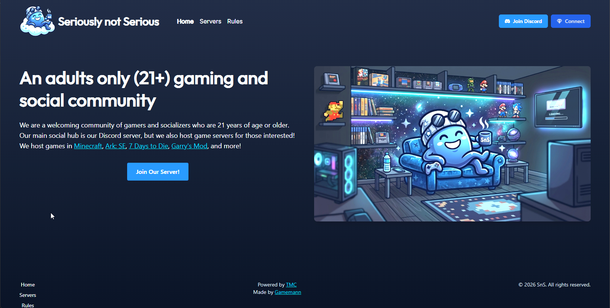

A website I made for my small 21+ gaming/social community. Built with [Astro](https://astro.build/) and [Tailwind CSS](https://tailwindcss.com/).

The website features a landing page, servers, rules, and more! Check it out [here](https://notserious.net)!



## Building
Firstly, clone the repository and install the dependencies:

```bash
# Clone the repository
git clone https://github.com/seriously-not-serious/website

# Change into the website directory
cd website

# Install dependencies
npm install
```

Next, you may run the development server:

```bash
npm astro dev
```

To build the website for production, run:

```bash
npm astro build
```

## Credits
* [Christian Deacon](https://github.com/gamemann)